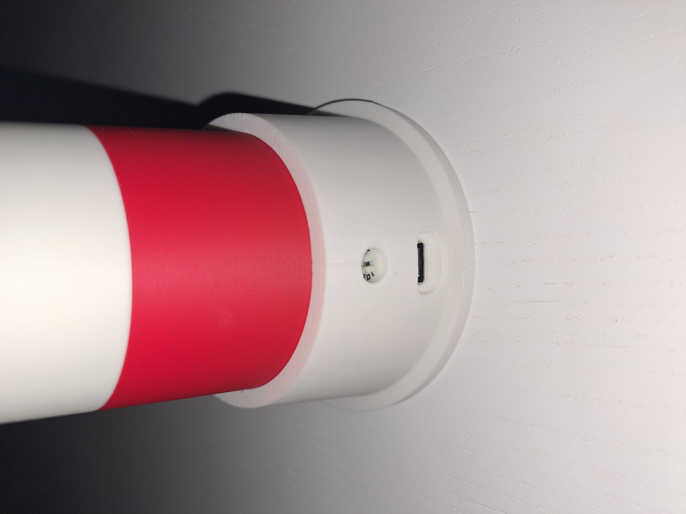

# Quiet Keep

A noise activated lighthouse to help kids find their inside voices.

## 🕹️ Usage

- Place the lighthouse high up on a shelf away from direct sound sources.
- When the lighthouse senses that the general noise level is too high, it will beep.
- If the lighthouse is beeping prematurely, turn the trimpot to the left to increase the sensitivity.
- If the lighthouse is not beeping at all, turn the trimpot to the right to decrease the sensitivity.

## 🔨 Make your own
### 🧱 Parts
- Arduino Nano with USB-C port
- Orange or yellow 5mm LED
- GY-MAX4466 microphone
- 10k Ohm trimpot (103)
- Piezo buzzer
- A bunch of wires

### 🧵 Wiring

### 🏗️ Assembly
[quiet_keep.step](quiet_keep.step) contains the models of the 3D-printed parts.

I printed the bottom of the roof in white to maximize the brightness.

**Printer:** Bambu Lab A1 with AMS

**Nozzle:** 0.4mm

**Preset:** 0.20mm Standard @BBL A1 with supports enabled

**Filaments:**
- Bambu Lab PLA Matte Ivory White (11100)
- Bambu Lab PLA Matte Scarlet Red (11200)
- Bambu Lab PLA Matte Charcoal (11101)

